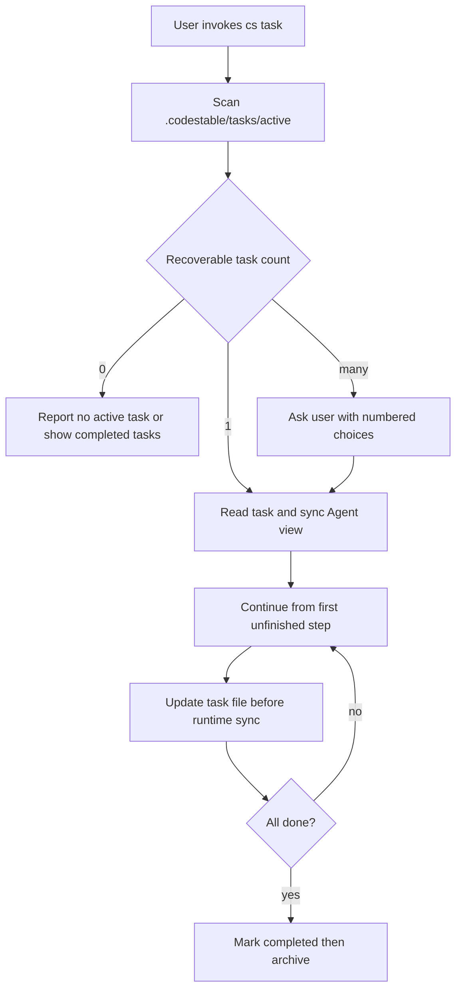

# task-core-storage-runtime design

## 0. 术语约定

- **Task List**：`.codestable/tasks/` 下的一份 Markdown 任务账本，是任务状态的 source of truth。
- **Active Task**：位于 `.codestable/tasks/active/` 且状态为 `active` 或 `blocked` 的任务。
- **Archived Task**：位于 `.codestable/tasks/archived/` 且状态为 `archived` 的历史任务。
- **cs-task Runtime**：新增 `cs-task` skill，负责发现、恢复、选择、完成和归档 Task List。
- **Agent Native Tasks**：Cursor / Claude Code / Codex / OpenCode 等工具自带的运行时任务视图，只是 Task List 的镜像。

## 1. 决策与约束

### 需求摘要

本 feature 为 CodeStable 增加最小可用的 task 存储和恢复入口：新增 `cs-task` skill、`cs-task/reference.md`、`.codestable/tasks/active|archived` 目录协议，并让根入口和共享约定能识别 task 实体。

### 明确不做

- 不接入所有现有 skill 的 auto / ask 分级；后续 `task-integration-policy` 负责。
- 不实现各 Agent 私有 SDK；本 feature 只定义通用同步和降级规则。
- 不替代 feature checklist 或 roadmap items。
- 不做跨项目 task 中心。

### 复杂度档位

走文档型 skill 默认档位，无代码运行时逻辑；主要风险是协议口径漂移和文档过长。

### 关键决策

- Task List 用 Markdown + frontmatter：人类可读，Agent 可按 frontmatter 和固定章节恢复。
- `active/` 与 `archived/` 分目录：避免当前任务和历史任务混在一个列表里。
- `cs-task` 只管理 task 自身，不为自己更新 task 文件递归创建新 task。

## 2. 名词与编排

### 2.1 名词层

**现状**：仓库没有 `cs-task/` skill；`.codestable/tasks/` 只有 bootstrap 记录，不是正式协议；`cs/SKILL.md` 不路由任务恢复。

**变化**：

- 新增 `cs-task/SKILL.md`：定义 task 发现、恢复、归档流程。
- 新增 `cs-task/reference.md`：定义 frontmatter schema、正文结构、状态机、交互协议。
- 更新 `cs/SKILL.md`：把“任务列表 / 继续任务 / 历史任务”路由到 `cs-task`。
- 更新 `cs-onboard/reference/shared-conventions.md`：把 `.codestable/tasks/` 纳入正式目录结构。

### 2.2 编排层

**现状**：不同 workflow 只能依靠各自 checklist / report / note 恢复，没有统一发现入口。

**变化**：`cs-task` 统一扫描 active 目录，根据状态决定恢复、选择、归档或报告无任务；所有用户选择必须用结构化编号选项。

**流程级约束**：

- 文件是 source of truth，Agent native tasks 是镜像。
- 每次步骤完成先写文件，再同步运行时任务。
- 多任务选择和归档冲突必须询问用户，不覆盖。

### 2.3 挂载点清单

- skill 注册：新增 `cs-task/SKILL.md` 和 `cs-task/reference.md`。
- 根入口路由：`cs/SKILL.md` 场景路由表新增 task 恢复入口。
- 共享目录约定：`cs-onboard/reference/shared-conventions.md` 新增 `.codestable/tasks/`。

### 2.4 推进策略

1. 文档骨架：创建 feature design / checklist / active task。
   退出信号：feature 目录和 task list 存在。
2. 核心 skill：新增 `cs-task/SKILL.md` 和 `reference.md`。
   退出信号：skill 能独立说明恢复和归档协议。
3. 根入口和共享约定：更新 `cs/SKILL.md`、shared conventions、roadmap items。
   退出信号：`cs` 能路由 task，onboard 模板包含 tasks。
4. 校验收尾：校验 YAML、检查文档行数和 lints。
   退出信号：items/checklist YAML 校验通过，单 md 不超过 300 行。

### 2.5 结构健康度与微重构

##### 评估

- 文件级 — `cs/SKILL.md`：约 164 行，只追加路由和目录说明，职责仍是根入口路由。
- 文件级 — `cs-onboard/reference/shared-conventions.md`：约 252 行，已接近 300 行上限，需要小幅补充，避免大段模板塞入。
- 目录级 — `cs-task/`：全新目录，仅放 `SKILL.md` 和 `reference.md`。

##### 结论：不做

本 feature 不做微重构。shared conventions 只写最小共享口径，详细 schema 放 `cs-task/reference.md`，避免单文件超过 300 行。

## 3. 验收契约

- 触发 `cs task` 类诉求 → `cs/SKILL.md` 明确路由到 `cs-task`。
- 读取 `cs-task/SKILL.md` → 能知道如何发现 active / completed / archived task。
- 读取 `cs-task/reference.md` → 能知道 Task List schema、正文结构、状态机、归档命名和 user_question_answer 规则。
- 检查 shared conventions → `.codestable/tasks/active` 与 `.codestable/tasks/archived` 是正式目录。
- 反向核对：本 feature 不应接入所有 skill 的 auto / ask 分级。

## 4. 与项目级架构文档的关系

本 feature 更新的是 CodeStable 技能包协议和 shared conventions；当前仓库尚无正式 architecture doc。acceptance 阶段只需核对 roadmap 回写，不做 architecture 归并。
