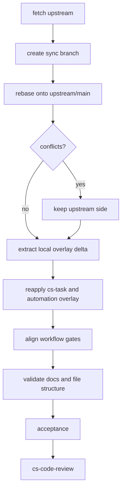

# sync-upstream-code-review design

## 0. 术语约定

- **upstream 原生 `cs-code-review`**：`upstream/main` 提供的 `cs-code-review` skill 及其 `agents/`、`references/`、`scripts/` 配套文件。防冲突结论：本 feature 中它是 review 能力本体的权威来源。
- **本地自动 review 门禁**：本地 fork 已在 feature / issue / refactor / fastforward 收尾阶段加入的“完成后自动进入 code review”流程衔接。防冲突结论：它是周边流程约束，不应重新实现一份 review 本体。
- **语义合并**：不机械保留某一边全文，而是按职责归属决定取舍：review 本体跟 upstream，流程衔接保留本地闭环并适配 upstream 新结构。
- **迁移分支**：从当前 `main` 新建的临时工作分支，用来执行 rebase 与冲突处理，避免在 `main` 上直接产生不可回滚状态。
- **upstream-first rebase**：每次同步都以 `upstream/main` 为主体；遇到内容冲突时默认保留 upstream 版本，再把本地扩展作为独立 overlay 补回。
- **本地 overlay patch stack**：把我们扩展出的 `cs-task` 与自定义自动化流程压成少量、可重放、可审查的本地增量提交或 patch，而不是散落改写 upstream 文件。
- **自定义自动化流程**：入口 → 分析 → 相关文档落地 → 创建 Task → 执行 → 回填 Task → Codex / `cs-code-review` review → Task 归档。

## 1. 决策与约束

### 需求摘要

- 做什么：把当前 fork rebase 到 `upstream/main`，采用 upstream 原生 `cs-code-review` 作为主体，并把本地 `cs-task` 与自定义自动化流程作为 overlay 增量保留。
- 为谁做：维护 CodeStable skills 的开发者和后续执行 feature / issue / refactor 工作流的 AI agent。
- 成功标准：迁移后代码主体与 upstream 对齐；冲突处默认保留 upstream 内容；`cs-code-review` 本体来自 upstream；本地仅以 overlay 方式补回 `cs-task` 与自动化闭环；后续每次 upstream 更新都有可重复的 rebase / overlay 重放流程。
- 明确不做：不在本 feature 里重新设计 upstream 的 review 协议；不顺手重写无关 skill；不保留两套互相竞争的 code review 入口；不把本地扩展散落成难以 rebase 的交叉修改；不直接在 `main` 上不可回滚地 rebase。

### 复杂度档位

- 走“技能体系迁移”默认档位，无运行时业务数据、数据库迁移、外部 API 或用户界面改动。
- 偏离点：Git 历史风险高于普通文档改动，因为 upstream 删除 / 重命名了多个本地仍引用的 skill，必须先在迁移分支验证冲突与语义差异。

### 关键决策

1. **upstream 是主体，本地是增量**：同步时优先执行 rebase；冲突处默认保留 upstream 内容，再以可审查 overlay 补回本地扩展。
2. **review 本体以 upstream 为权威**：`cs-code-review/SKILL.md`、`agents/`、`references/`、`scripts/` 优先采用 upstream 结构；本地不再维护旧版 custom review 逻辑。
3. **本地扩展沉淀为 patch stack**：`cs-task`、Task 创建 / 回填 / 归档、入口到 review 的自动编排作为少量 topic commits 或 patch 维护，避免每次 rebase 都在同一 upstream 文件里大面积冲突。
4. **自动门禁作为周边流程契约保留**：`cs-feat*`、`cs-issue*`、`cs-refactor*` 等流程只表达“何时进入 `cs-code-review` / Codex review”，不复制 review 执行细节。
5. **先迁移分支，后决定发布方式**：先 `git fetch upstream`，从当前 `main` 新建迁移分支并 rebase；验证通过后再决定 merge / PR / fast-forward。
6. **同步相关技能表述**：新增或更新 `cs-code-review` 后，必须同步 `cs/SKILL.md`、`cs-onboard/reference/system-overview.md`、共享口径、流程收尾 skill 中的描述。

### 前置依赖

- 当前工作区必须干净或仅包含本 feature 的 CodeStable 产物。
- `upstream` remote 必须可 fetch；已确认存在 `upstream/main`。
- rebase 前必须先识别本地 overlay 范围：`cs-task`、Task 账本协议、自动编排入口、Task 回填、Codex / `cs-code-review` handoff、Task archive。

## 2. 名词与编排

### 2.1 名词层

#### 现状

- 本地已有 `cs-code-review/SKILL.md` 与 `cs-code-review/reference.md`，定义独立 code review 门禁、报告模板和 Task 接入。
- 本地已有 `cs-task` 与自动化闭环：入口分诊、分析、相关文档落地、创建 Task、执行、回填 Task、Codex / `cs-code-review` review、Task 归档。
- 本地流程入口已在 `cs/SKILL.md`、`cs-feat/SKILL.md`、`cs-feat-accept/SKILL.md` 等文件中描述“完成后进入 `cs-code-review`”。
- upstream/main 提供新的 `cs-code-review` 结构：包含 `agents/openai.yaml`、`references/report-template.md`、`scripts/detect-review-agent.py`，并删除旧 `reference.md`。

#### 变化

- `cs-code-review` 本体替换为 upstream 结构，旧 `reference.md` 不再作为权威模板。
- 本地 `cs-task` 与自动化闭环改为 overlay 增量维护：优先独立文件 / 独立 section / 小型 topic commit，减少直接改写 upstream 主体段落。
- 各流程 skill 的 review 衔接语义保留，但改为指向 upstream 原生 `cs-code-review` 的入口和产物格式。
- 与 code review 路由、Task spine、自动化闭环相关的总览、共享口径、onboard 模板同步更新，避免新项目 onboard 出旧结构。

#### 接口示例

```text
输入：标准 feature 完成 acceptance，Task owner_skill 切到 cs-code-review
输出：执行 upstream 原生 cs-code-review，产出 .codestable/features/{feature}/{slug}-code-review.md，回填 Task 状态，并阻止 Critical / Important 未清零时进入 commit
```

```text
输入：feature fastforward 完成 ff-note
输出：仍进入同一个 upstream 原生 cs-code-review，不走旧 custom review 或自审短路
```

```text
输入：upstream/main 再次更新
输出：创建 sync 分支 rebase upstream；冲突处保留 upstream；重放本地 overlay patch stack；运行 gate 验证本地扩展仍可用
```

### 2.2 编排层



#### 现状

- 当前 `main` 与 `origin/main` 对齐，但相对 `upstream/main` 有本地独有提交，包括本地 `cs-task`、流程自动化、旧 custom code review、子入口闭环修复。
- upstream 新提交包含原生 review / QA / goal gate 工具链，并对部分旧 skill 做删除或重命名。

#### 变化

- Git 操作从迁移分支开始，不直接污染 `main`。
- rebase 是首选同步方式；遇到冲突时默认保留 upstream 内容，随后重放本地 overlay，而不是在冲突文件里手工混成不可复用的一次性结果。
- overlay 分两层：`cs-task` 这类独立能力尽量保持独立目录 / 文件；必须改 upstream 文件的自动化流程描述，保持为短小、可定位的局部段落。
- 合并后用全仓搜索确认 `cs-code-review`、`cs-task`、Task archive、Codex review handoff 引用一致，尤其是 feature / issue / refactor / fastforward 收尾路径。

#### 流程级约束

- 错误语义：rebase 冲突无法确定职责归属时默认取 upstream；只有 overlay 重放失败且影响 `cs-task` / 自动化闭环时才停下来让用户选择。
- 幂等性：迁移分支可删除重建；不在确认前改写 `main` 历史。
- 顺序约束：先 rebase 到 upstream 主体，再重放 overlay，再校准周边流程；反过来会让本地改动继续和 upstream 主体缠在一起。
- 可观测点：`git status`、`git log upstream/main..HEAD`、`git diff --name-status upstream/main..HEAD`、overlay patch 清单、全仓 `rg` review / task 关键词、Markdown 行数检查、必要的 YAML 校验。

### 2.3 挂载点清单

- Skill 入口：`cs-code-review/SKILL.md` — 替换为 upstream 原生 review 门禁入口。
- Review 模板目录：`cs-code-review/references/`、`cs-code-review/agents/`、`cs-code-review/scripts/` — 新增 upstream 配套挂载点。
- Task spine：`cs-task/`、`.codestable/reference/shared-conventions.md` 的 task list 协议、`cs-onboard/tools` 中相关工具 — 作为本地 overlay 能力保留。
- 自动化流程协议：`cs/SKILL.md` 与各 direct entry skill 的入口 → 分析 → 文档落地 → Task → 执行 → 回填 → review → archive 描述 — 作为本地 overlay 的跨流程契约。
- Feature 收尾：`cs-feat-accept/SKILL.md`、`cs-feat-ff/SKILL.md`、`cs-feat/SKILL.md` — 保留完成后进入 `cs-code-review`。
- Issue / refactor 收尾：`cs-issue-fix/SKILL.md`、`cs-refactor/SKILL.md`、`cs-refactor-ff/SKILL.md` — 保留完成后进入 `cs-code-review`。
- Onboard 模板与总览：`cs-onboard/reference/shared-conventions.md`、`cs-onboard/reference/system-overview.md`、`cs/SKILL.md` — 同步新 review 结构和产物路径。

### 2.4 推进策略

1. Git 安全骨架：fetch upstream，创建 sync 分支并记录本地 overlay 候选提交。
   退出信号：sync 分支存在，`git status` 可证明未污染 `main`。
2. Upstream-first rebase：执行 rebase；冲突处保留 upstream 内容。
   退出信号：工作树成功落在 upstream 主体之上，冲突文件没有混合旧 custom review 本体。
3. Overlay patch 重放：把 `cs-task` 与自动化闭环作为独立增量补回。
   退出信号：`git diff upstream/main..HEAD` 能清楚看出本地增量边界，而不是一团混合改动。
4. 自动门禁校准：逐个更新 feature / issue / refactor / fastforward 收尾 skill。
   退出信号：所有收尾路径都明确进入 upstream 原生 `cs-code-review`，并能回填 / 归档 Task。
5. Onboard 与共享口径同步：更新新项目模板和体系总览。
   退出信号：`cs-onboard/reference/*` 与根技能描述没有旧结构残留。
6. 验证与验收：搜索残留、检查 Markdown 行数、校验 YAML，产出 acceptance。
   退出信号：无阻塞残留，进入 `cs-code-review`。

### 2.5 结构健康度与微重构

##### 评估

- 文件级 — `cs-code-review/SKILL.md`：review 本体变化大，但应通过 upstream 替换解决，不在本地继续拆分旧逻辑。
- 文件级 — `cs-task/` 与 Task 相关协议：本地扩展应尽量维持独立边界，避免散落改写 upstream 主体段落。
- 文件级 — 流程收尾 skills：多为局部语义校准，不需要重组文件；但局部段落必须短小、可重复重放。
- 目录级 — `cs-code-review/`：upstream 已从单 `reference.md` 拆到 `references/`、`agents/`、`scripts/`，本 feature 应采用该结构。
- 目录级 — 本地 overlay patch：不建议把一次性生成的 patch 文件长期塞进主代码目录；更稳的是维护少量 topic commits，并在验收报告中记录 `git format-patch upstream/main..HEAD` 的生成命令。
- 目录级 — `.codestable/features/2026-06-28-sync-upstream-code-review/`：只新增 design / checklist / acceptance / code-review，目录不摊平。

##### 结论：不做本地微重构，但建立 overlay 维护纪律

原因：结构变化来自 upstream 目录形态，本 feature 的正确动作是接受 upstream 结构并校准引用；本地扩展通过 topic commits / patch stack 保持可重放，额外拆分流程 skill 会扩大范围。

##### 超出范围的观察

- upstream 同时移除了 `cs-task`、`cs-arch`、`cs-explore` 等本地仍可能依赖的能力。本 feature 明确选择保留 `cs-task` 作为本地 overlay；其他被移除能力是否保留，后续按同一 overlay 纪律单独决策。

### 2.6 长期 rebase 策略

后续每次 upstream 更新都按同一流程执行：

1. `git fetch upstream`。
2. 从当前集成分支创建 `sync-upstream-YYYYMMDD`。
3. 执行 `git rebase upstream/main`；冲突处默认保留 upstream 内容。注意 rebase 冲突中 `ours` 表示当前已 rebased 的 upstream 侧，`theirs` 表示正在重放的本地提交。
4. 对必须保留的本地能力重放 overlay：`cs-task`、自动化流程、Task 回填 / 归档、Codex / `cs-code-review` handoff。
5. 用 `git diff --name-status upstream/main..HEAD` 检查本地增量是否仍集中、可解释。
6. 需要交接或备份时，用 `git format-patch upstream/main..HEAD` 生成 patch bundle；patch 作为发布 / 迁移证据，不作为替代源码的主维护方式。
7. 跑验收清单：review gate、Task spine、onboard 模板、Markdown 行数、YAML。

原则：**长期维护的是“upstream + 少量本地 overlay commits”，不是一条和 upstream 平行演化的大 fork。**

## 3. 验收契约

### 关键场景清单

- S1：执行同步后查看 `cs-code-review/` → 目录结构包含 upstream 原生 `agents/`、`references/`、`scripts/`，旧 `reference.md` 不再作为权威模板。
- S2：rebase 冲突处理 → 冲突处默认保留 upstream 内容；本地功能只通过 overlay 增量重新出现。
- S3：标准 feature acceptance 完成 → skill 文档明确下一步进入 `cs-code-review`，且 review 通过前不进入 commit / PR / merge。
- S4：自定义自动化流程 → 入口、分析、文档落地、创建 Task、执行、回填 Task、Codex / `cs-code-review` review、Task 归档均有清晰协议。
- S5：feature fastforward / issue fix / refactor 收尾 → 均能找到进入 `cs-code-review` 的自动门禁描述。
- S6：新项目 onboard 模板 → `shared-conventions` 与 `system-overview` 中的 code review / task spine 路径与当前结构一致。
- S7：长期同步演练 → 能通过 `git diff upstream/main..HEAD` 和可选 `git format-patch upstream/main..HEAD` 解释本地 overlay 边界。
- S8：冲突处理后搜索 `custom code review`、旧 `reference.md` 权威引用、过时 review gate 描述 → 无阻塞残留。

### 明确不做的反向核对项

- 不应出现两套并列的 code review 本体描述。
- 不应把 upstream 的 `cs-code-review` 复制到其他流程 skill 内部。
- 不应在本 feature 中删除本地 Task 账本语义；它是明确保留的 overlay 能力。
- 不应为了保留本地能力而覆盖 upstream 主体实现；冲突处应先保留 upstream，再重放本地 overlay。
- 不应在未验证迁移分支前改写 `main` 历史。

## 4. 与项目级架构文档的关系

- 架构归并对象：CodeStable 技能体系的最终质量门禁形态。
- 预计更新：`.codestable/architecture/ARCHITECTURE.md` 的核心概念或已知约束中补充“`cs-code-review` 是统一最终质量门禁，具体实现采用 upstream 原生目录结构”。
- 总览同步：`cs/SKILL.md`、`cs-onboard/reference/system-overview.md`、`cs-onboard/reference/shared-conventions.md` 必须与本次迁移后的实际结构一致。
- requirement 回写：本次为维护性迁移，不新增独立用户能力，`requirement` 留空；acceptance 阶段只核实是否需要 backfill。
