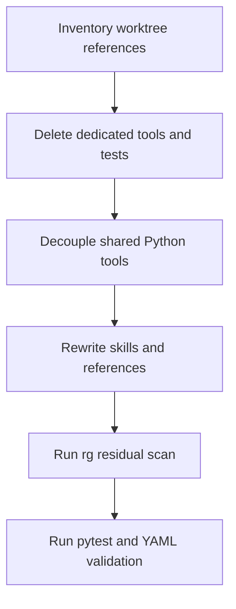

# remove-worktree-flow design

## 0. 术语约定

| 术语 | 定义 | 防冲突结论 |
|---|---|---|
| worktree flow | CodeStable 中强制使用 linked git worktree 的执行拓扑、gate、hook、inbox、finish 记录。 | 全部移除，不再作为 CodeStable 默认能力或可选能力出现。 |
| protected branch rule | 禁止在 `main` / `master` 等受保护分支上直接发布或做高风险操作的安全原则。 | 仅保留为文字层面的谨慎原则；本次不新增替代 hook。 |
| review evidence | feature / issue / refactor 完成后必须有代码审查报告与 reviewer 证据。 | 保留，和 worktree 解耦。 |
| task spine | `.codestable/tasks/` 下的任务账本闭环。 | 保留，和 worktree 解耦。 |

## 1. 决策与约束

### 需求摘要

- 目标：去除当前 CodeStable 项目中所有 worktree 相关功能、调用和流程。
- 成功标准：仓库中不再存在 worktree gate / branch guard / finish worktree / inbox 工具和测试；技能、README、reference 文档不再要求或推荐 worktree 流程。
- 明确不做：
  - 不实现新的 branch guard hook 替代品。
  - 不改变 review evidence、Task spine、YAML 校验、review packet 等非 worktree 能力。
  - 不修改用户仓库的 `.git` 私有记录或清理历史 git worktree。
  - 不创建提交、不推送、不改 git 配置。

### 复杂度档位

走工具/流程清理默认档位。偏离点：影响面横跨源码工具、测试、技能文档、README 和 reference 文档，因此必须先用设计清单收束范围，再执行删除。

### 关键决策

1. **直接删除 worktree 专属脚本**：`codestable-worktree-gate.py`、`codestable-finish-worktree.py`、`codestable-worktree-inbox.py`、`codestable-ai-branch-guard.py`、`hooks.codex.json`。这些文件的职责与 linked worktree 强绑定，保留会让流程叙事继续漂移。
2. **改写共享工具而非删除共享工具**：`codestable_common.py` 和 `codestable-doctor.py` 仍承载路径分桶、review/task/backlog 诊断，应删除 worktree helper 与阻断规则后保留。
3. **测试随能力删除同步收缩**：删除 worktree gate / branch guard 测试，改写 doctor 与 validate implementation review 中的 worktree 断言。
4. **文档改成 branch-neutral execution**：README、技能和 reference 不再出现“必须 linked worktree / worktree override / quarantine / worktree inbox / branch guard hook”。

### Top 3 风险

1. **隐藏发布副本不同步**：只清理技能包源码，漏掉项目内 `.codestable/tools`、`.codestable/hooks`、`.codestable/reference` 已发布副本。缓解：把源码侧和 `.codestable` 发布副本作为同一类交付物同步清理。
2. **残留引用**：root docs、workflow/catalog、技能或 reference 里还有旧命令、旧 hook 或旧语义词。缓解：实现后拆分脚本名扫描和语义词扫描，残留只允许出现在本 feature 流程产物中。
3. **误删非 worktree 质量门禁**：review evidence / task spine / YAML 校验 / review packet 被连带破坏。缓解：只删除与 worktree 命名、linked-worktree 判断、baseline、inbox、finish record 直接相关的函数与测试。

### 事实基线清单

实现前必须把命中项按类别登记，至少覆盖：

- 工具源码：`cs-onboard/tools/` 下 worktree gate、branch guard、finish、inbox、doctor、common、validate implementation review 相关代码。
- 发布副本：`.codestable/tools/`、`.codestable/hooks/`、`.codestable/reference/` 中已复制的同类脚本、hook 和参考文档。
- hooks：`cs-onboard/hooks/hooks.codex.json` 与 `.codestable/hooks/hooks.codex.json`。
- tests：worktree 专属测试、branch guard 测试、doctor 测试、validate implementation review 测试、workflow contract 测试。
- skills：feature、issue、refactor、task、goal、code-review、onboard 等流程技能中的 worktree gate / override / finish / branch guard 表述。
- root docs：`README*.md`、`WORKFLOW*.md`、`SKILL_CATALOG*.md`、`CLAUDE.md`、`AGENTS.md` 等用户入口文档。
- onboard reference：`shared-conventions.md`、`tools.md`、`tools-context.md`、`execution-conventions.md`、`approval-conventions.md`、`branch-guard-hooks.md`、`system-overview.md`、`reference.md`。

### 必跑验证命令

- 脚本名残留扫描：`rg -n "codestable-worktree-gate|codestable-ai-branch-guard|codestable-finish-worktree|codestable-worktree-inbox|hooks\.codex\.json" .`
- 语义残留扫描：`rg -n "linked worktree|execution worktree|worktree override|worktree-override|quarantine|ready-to-merge|worktree inbox|branch guard|branch-guard|git worktree|worktree gate|worktree-gate" .`
- 发布副本扫描：`rg -n "worktree|branch-guard|finish-worktree|worktree-inbox|quarantine|ready-to-merge" .codestable cs-onboard README.md README.en.md WORKFLOW.md WORKFLOW.en.md SKILL_CATALOG.md SKILL_CATALOG.en.md CLAUDE.md AGENTS.md`
- `python3 -m pytest tests`
- `python3 .codestable/tools/validate-yaml.py --file .codestable/features/2026-06-30-remove-worktree-flow/remove-worktree-flow-checklist.yaml --yaml-only`

## 2. 名词与编排

### 2.1 名词层

#### 现状

- `cs-onboard/tools/codestable-worktree-gate.py`：实现 start / commit / quarantine gate，记录 baseline 并强制 linked worktree。
- `cs-onboard/tools/codestable-ai-branch-guard.py`：hook 脚本，阻止受保护分支实现并引导到 linked worktree。
- `cs-onboard/tools/codestable-finish-worktree.py`、`codestable-worktree-inbox.py`：维护 worktree finish / ready-to-merge inbox。
- `cs-onboard/tools/codestable_common.py`：同时包含通用 git/review/task helper 和 worktree baseline/inbox helper。
- `cs-onboard/tools/codestable-doctor.py`：诊断 dirty bucket、review/backlog，同时把非 linked worktree 的实现变更判为阻塞。
- `cs-onboard/tools/validate-implementation-review.py`：实现审查门禁，同时含 linked worktree 约束。
- `.codestable/tools/`、`.codestable/hooks/`、`.codestable/reference/`：项目内已发布副本，可能与技能包源码同时残留旧流程。
- `README*.md`、`WORKFLOW*.md`、`SKILL_CATALOG*.md`、`CLAUDE.md`、`AGENTS.md`：用户入口文档可能继续宣传旧 worktree 执行约定。
- `tests/`：包含工具行为测试、doctor 回归测试、validate implementation review 测试和 workflow/reference 合同测试。

#### 变化

- 删除 worktree 专属脚本与 hook 配置。
- 同步删除或改写 `.codestable` 已发布副本，避免新项目和当前项目继续消费旧资产。
- 从 `codestable_common.py` 移除 `is_linked_worktree`、baseline、override、inbox、finish/merge worktree helper。
- 从 `codestable-doctor.py` 移除 worktree inbox、post baseline、linked worktree 阻断字段和文案。
- 从 `validate-implementation-review.py` 移除 linked worktree / main checkout override 检查，只保留 review evidence 检查。
- 更新工具测试和流程合同测试，使剩余测试只覆盖 review evidence、task spine、dirty buckets、backlog、YAML 和文档合同等保留能力。

#### 接口示例

```json
// 来源：cs-onboard/tools/codestable-doctor.py diagnose
{
  "status": "implementation-active",
  "checkout": {"current_branch": "feat/example", "default_branch": "main"},
  "implementation_changes": ["src/example.ts"],
  "findings": []
}
```

### 2.2 编排层



#### 现状

实现流程由多个 skill 在动手前调用 `codestable-worktree-gate.py start`，完成前调用 `commit`，onboard 可释放 branch guard hook，doctor 和 validate review 会把 worktree 状态当成生命周期阻断条件。

#### 变化

实现流程不再调用任何 worktree gate。生命周期收口改为 Task spine、review evidence、QA/acceptance 和普通验证命令。doctor 只报告仓库状态和 CodeStable 流程缺口，不再判断 linked worktree。

#### 流程级约束

- 删除脚本时必须同步删除或改写所有引用该脚本的文档和测试。
- 文档中允许出现“历史上曾有 worktree flow”只在迁移说明中出现；常规技能说明不保留旧流程。
- `rg` 残留若只来自本 feature design/review/checklist/task，可接受；仓库产品文档、技能、工具源码、发布副本和测试中不得残留旧流程指令。

### 2.3 挂载点清单

- `.codestable/tools/` 发布内容：删除 worktree 专属工具脚本，避免 onboard 继续释放旧能力。
- `.codestable/hooks/` 发布内容：删除 branch guard hook 配置。
- `.codestable/reference/` 发布内容：同步移除 worktree gate、finish、inbox、override、quarantine、branch guard hook 说明。
- `cs-onboard/tools/` / `cs-onboard/hooks/` / `cs-onboard/reference/` 技能包源内容：删除或改写对应源码和模板，避免后续 onboard 再复制旧流程。
- `cs-onboard/SKILL.md` 标准骨架：移除 tools/hooks 中 worktree/branch-guard 的宣传和退出条件。
- `cs-feat-impl` / `cs-issue-fix` / `cs-refactor` / `cs-refactor-ff` / `cs-feat-ff` / `cs-task` / `cs-goal` / `cs-code-review`：移除实现前后 worktree gate、finish gate、override、branch guard 表述。
- `README*.md` / `WORKFLOW*.md` / `SKILL_CATALOG*.md` / `CLAUDE.md` / `AGENTS.md`：移除用户可见的 worktree 流程说明。

### 2.4 推进策略

1. 盘点引用：用脚本名扫描和语义扫描生成分类 inventory。
   退出信号：命中文件已按工具源码、发布副本、hooks、tests、skills、root docs、reference 分组登记。
2. 删除专属资产：移除 worktree gate、finish、inbox、branch guard、hook 及其发布副本。
   退出信号：被删脚本名和 hook 配置不再被非 feature 流程产物引用。
3. 解耦共享工具：改写 common、doctor、validate implementation review。
   退出信号：工具可运行且输出不含 linked worktree / inbox / post baseline 字段。
4. 改写测试：删除专属测试，更新 doctor、validate implementation review、workflow contract 测试。
   退出信号：测试不再导入已删除脚本，保留能力仍有回归覆盖。
5. 改写流程文档：更新 README、workflow/catalog、技能和 reference。
   退出信号：旧 gate 命令、override、quarantine、inbox、finish、branch guard 说明消失。
6. 测试与残留扫描：运行 pytest、YAML 校验、脚本名扫描、语义扫描、发布副本扫描。
   退出信号：测试通过，残留仅限本 feature design/checklist/review/task 产物。

### 2.5 结构健康度与微重构

##### 评估

- 文件级 — `codestable_common.py`：职责混合，包含通用 helper 与 worktree helper；本次删除 worktree helper 是能力移除，不是纯搬移。
- 文件级 — `codestable-doctor.py`：当前诊断结构可保留，删除 worktree 分支后不需要拆文件。
- 文件级 — 技能/README/workflow/catalog/reference 文档：多处文字替换和段落删除，属于流程同步，不需要拆文档。
- 目录级 — `cs-onboard/tools/`：删除 4 个脚本后目录更聚焦，不新增文件。
- 目录级 — `.codestable/tools/` / `.codestable/hooks/` / `.codestable/reference/`：同步删除发布副本，不新增目录。
- 目录级 — `tests/`：删除 worktree 测试后不新增测试目录。

##### 结论：不做微重构

原因：本次目标是移除能力，不是重新组织工具目录；共享工具只做定点删除和文案解耦，新增抽象收益低且会扩大风险。

## 3. 验收契约

### 关键场景清单

1. 触发脚本名残留扫描 → worktree gate、branch guard、finish worktree、worktree inbox 和 hook 配置不再存在于非 feature 流程产物中。
2. 触发语义残留扫描 → linked/execution worktree、worktree override、quarantine、ready-to-merge、branch guard 等旧流程语义不再存在于产品技能、root docs、reference、工具源码、发布副本和测试中。
3. 运行 `python3 -m pytest tests` → 剩余测试通过，且没有导入已删除脚本失败。
4. 运行 `codestable-doctor.py --json` → 输出不含 `linked_worktree`、`worktree_inbox`、`post_baseline_blocks`、`ready_to_merge_worktrees` 字段。
5. 运行 `validate-implementation-review.py --json` → 只检查实现 review evidence，不因当前 checkout 是否 linked worktree 阻塞。
6. 查看 feature / issue / refactor / task / goal / code-review / onboard 技能 → 实现流程不再要求 start/commit worktree gate、finish worktree 或 worktree override。

### 明确不做的反向核对项

- 不应新增 `protected-branch-guard.py` 或替代 hook。
- 不应删除 `validate-yaml.py`、`search-yaml.py`、`build-review-packet.py`、`validate-implementation-review.py` 的非 worktree 能力。
- 不应修改 git 配置或执行 worktree 清理命令。

## 4. 与项目级架构文档的关系

本 feature 改变 CodeStable 的执行约定，应在实现通过后同步 README、英文 README、`cs-onboard/reference/system-overview.md` 或相关 reference，使新项目 onboard 后不再继承 worktree 流程。无需新增 ADR；这是移除旧执行机制，不是引入新的架构机制。
