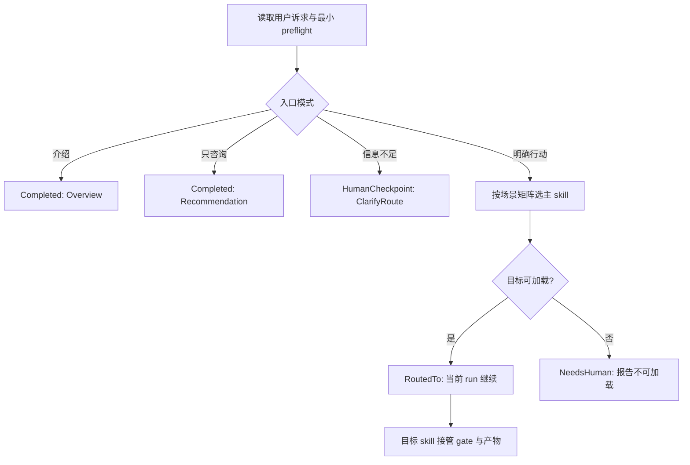

# CS Router Direct Dispatch

## 0. 术语约定

| 术语 | 定义 | 防冲突结论 |
|---|---|---|
| 入口模式 | 用户本轮是要执行、只咨询、看体系介绍，还是信息不足 | 不等同于目标 workflow 的 stage / mode |
| 路由目标 | `cs` 根据单一场景矩阵选出的已安装主 skill | 只选主入口，不选 deprecated stage skill |
| 同轮转交 | 按已安装 skill 名称加载目标协议，携带原始诉求并在当前 run 继续 | 不代表新建 agent；目标 skill 自己决定 gate 和执行拓扑 |
| route brief | 告知目标与理由的短状态说明 | 执行模式下是进度信息，不是终止本轮的最终答复 |

## 1. 决策与约束

### 1.1 需求摘要

用户目标：调用 `/cs <诉求>` 时，不再收到“请再调用另一个 skill”的死端；路由明确时直接开始目标 workflow。

核心行为：

- 明确行动请求且路由唯一：加载目标 skill，在当前 run 继续，保留原始用户诉求和已完成的 preflight 上下文。
- 只问“该用哪个 skill”或请求介绍体系：只输出建议或体系速读，不执行目标 workflow。
- 路由存在实质歧义：返回 `HumanCheckpoint ClarifyRoute`，只问一个能区分相邻 workflow 的聚焦问题；确认后同轮转交。
- 目标 skill 不可加载：停止并报告，不在 `cs` 内模拟目标流程。

成功标准：根路由、共享约定、二级路由出口、README / catalog / workflow 和测试对上述行为使用同一口径。

明确不做：

- 不让 `cs` 写 feature / issue / refactor 等下游产物。
- 不让 `cs` 越过目标 skill 的用户 checkpoint、审批或安全 gate。
- 不引入可执行路由引擎、关键词解析器或新的公开 skill。
- 不删除旧 stage skill；兼容入口继续按现有契约转入主入口。
- 不把 route brief 扩展成 L0-L4 治理报告；治理级别由目标 workflow 负责。

### 1.2 复杂度档位

按公开 skill 契约默认档位推进；`Compatibility = backward-compatible`：保留 `/cs` 的咨询和体系介绍能力，只改变明确行动请求的终止行为。

### 1.3 关键决策

1. **先判入口模式，再判路由目标。** “执行”与“咨询”不能靠同一条 route brief 隐式表达。
2. **专用 workflow 优先于 goal 包装器。** 单 feature、bug、行为等价重构、对外文档和 epic 即使带“做到完成”，仍分别进入 `cs-feat`、`cs-issue`、`cs-refactor`、`cs-docs`、`cs-epic`；`cs-goal` 只接没有更专用生命周期入口的有界终点。
3. **用判别轴处理相邻路线。** 已知优化目标走 `cs-refactor`，主动找问题走 `cs-audit`；长期 canonical 决策走 `cs-domain`，复用经验走 `cs-keep`。
4. **同轮转交复用兼容入口的成熟契约。** 加载已安装 skill、当前 run 继续、不得要求用户重新调用、加载失败明确停止。
5. **onboard 是串行前置 gate 例外。** 未接入仓库的行动请求先转 `cs-onboard`；它自行执行写入 checkpoint。接入完成后保留原始诉求并继续同轮转交原目标，而不是并行启动两个 skill。若 onboard 停在用户 checkpoint，恢复时仍携带原始诉求，不要求用户重新拼命令。
6. **只在续作不明确时扫描活动单元。** 明确诉求直接交给目标 skill 恢复自身仓库事实；“继续 / 下一步”才浅扫 features、issues、roadmap、goals、refactors、audits、brainstorms、feedback。
7. **跨 skill 通用语义进入 execution conventions。** 共享约定区分“已确认出口”（直接同轮加载）和“待确认出口”（先停用户，确认后同轮加载）；同步修改 `cs-onboard` 模板和当前项目 runtime copy。brainstorm case 1/2/4 是待确认出口，用户点头后同轮进入目标；case 3 已定义为“用户 ready 直接拆解”，属于已确认出口，同轮进入 `cs-epic`。audit 选中 finding 同样属于已确认出口。
8. **root skill 的宿主触发面保持窄。** frontmatter description 改为“用户显式调用 cs / 询问该用哪个 skill / 请求体系介绍 / 诉求未收敛”；不抢占本可由 `cs-feat` 等描述直接命中的普通请求。新增 contracts 锁 `HumanCheckpoint ClarifyRoute`、当前 run 继续和禁止 L0-L4。

### 1.4 风险、依赖与假设

Top 3 风险：

1. 行动与咨询误判导致意外落盘。缓解：入口模式优先；目标 skill 仍保留自身 checkpoint。
2. `cs-goal` 吞掉专用 workflow。缓解：专用 workflow 优先级写入唯一场景矩阵，并加冲突 fixtures。
3. 文档、测试和 installed/runtime copy 漂移。缓解：同步中英文文档、runtime sync check、模板↔副本静态一致性测试和独立 Task agent review。

非显然依赖：

- 宿主必须支持按已安装 skill 名称加载协议；现有 15 个兼容入口已经使用并测试这条能力。
- routing eval 的 `buildprompt.py` 使用固定 result_type 词汇；本 feature 复用 `RoutedTo`、`HumanCheckpoint`、`Completed`、`NeedsHuman`，不扩展 scorer 或共享枚举。

关键假设：用户说“根据建议优化”已确认上一轮提出的行为方向；若独立 design review 引入新的产品取舍，再停用户确认。

必跑验证命令：

- `PYTHONDONTWRITEBYTECODE=1 pytest -q tests/test_skill_entry_simplification.py tests/test_skill_workflow_scenarios.py tests/test_skill_contracts.py`
- `PYTHONDONTWRITEBYTECODE=1 pytest -q tests`
- `python tools/check-plugin-package.py --root . --json`
- `python3 plugins/codestable/skills/cs-onboard/tools/codestable-runtime-sync.py --root . --source-skill-dir plugins/codestable/skills/cs-onboard --check --json`
- `git diff --check`

基线风险：裸 `pytest -q` 会误收集 `experiments/**/hidden` 与 seed tests，并因环境缺少 `taskhub` 在 collection 阶段失败；核心回归固定跑 `pytest -q tests`。插件包检查已有 `CHANGELOG.md` 缺 `1.0.2`、marketplace version 与 `VERSION` 不一致两条发布基线，本 feature 只记录，不顺手修发布元数据。

交付物：根 router skill、共享执行约定及 runtime copy、brainstorm / audit 出口、相关中英文文档、静态测试、`cs-routing-001` 预注册 fixtures、feature review / QA / acceptance 证据。

清洁度：不新增调试输出、临时 TODO/FIXME、占位文本、注释掉规则或无引用测试 helper。

## 2. 名词与编排

### 2.1 名词层

**现状**：`plugins/codestable/skills/cs/SKILL.md` 只有 route brief，没有区分入口模式；`Route Level Quick Reference` 要求输出未定义且覆盖不全的 L0-L4。兼容入口已经定义同轮加载协议。

**变化**：新增概念契约 `IntakeMode = Execute | Advise | Explain | Ambiguous`，结果复用 routing harness 的既有词汇：`RoutedTo Target`、`HumanCheckpoint ClarifyRoute`、`Completed (Recommendation Target | Overview)`、`NeedsHuman Reason`。路由目标仍是现有主 skill 集合，不新增实体。

接口示例：

```text
/cs 修复登录偶发 500
-> RoutedTo(cs-issue, original_request) -> 当前 run 开始 issue workflow

/cs 这种问题该用哪个 skill？
-> Completed(Recommendation cs-issue) -> 本轮不执行
```

最小 route brief：

```text
Route: {目标主入口}
Reason: {一句话判别依据}
Dispatch: continuing-current-run | recommendation-only
```

route brief 只用于 Execute / Advise：Execute 输出后继续加载目标，Advise 输出后结束。Explain 直接输出体系速读；Ambiguous 直接输出一个聚焦问题，两者不伪造 route brief。

Interface 检查：`cs` 保持窄接口，只做模式判定与目标选择；所有 workflow 复杂度仍封装在目标 skill 内。同轮加载是既有 seam，不新增 adapter。

### 2.2 编排层



**现状**：每次调用都扫描部分活动目录，然后输出 route brief 并结束；二级路由有“重新触发”和“移交”两种口径。

**变化**：入口模式决定是否终止；执行模式的 route brief 仅作状态说明，随后必须加载目标 skill。明确请求不做全局目录扫描；续作请求扫描完整活动根并在多候选时询问。

流程级约束：

- preflight 在同一会话幂等复用，目标 skill 不重复读取已确认的 attention/runtime 结论。
- 原始请求原样传递，不改写成丢失限定条件的摘要。
- route choice 不授权额外副作用；目标 skill 的写入、外部通信和用户 checkpoint 仍生效。
- 一个请求同一时刻只转交一个主入口；onboard 前置 gate 完成后可串行继续原目标。两个独立诉求先确认执行顺序。
- 已确认出口直接同轮加载；待确认出口只停一次，用户点头后同轮加载，不要求重新调用命令。

### 2.3 挂载点清单

1. `plugins/codestable/skills/cs/SKILL.md`：修改根入口公开行为契约。
2. `plugins/codestable/skills/cs-onboard/references/execution-conventions.md`：新增跨 skill 转交共享约定，并同步当前 runtime copy。
3. README / WORKFLOW / SKILL_CATALOG / system overview 中英文入口说明：从“告诉用户再调用”改为按入口模式分流。
4. `tests/` 与 `experiments/cs-routing-001/`：锁定契约与冲突路线。

### 2.4 推进策略

1. 契约骨架：先写失败的静态契约测试与 routing fixtures，再改 `cs` 的 frontmatter、Spec、优先级和 RoutedTo 规则；同步更新旧 router 场景断言，删除独立硬编码的 `route_request` 模拟。
   退出信号：测试能验证 Execute / Advise / Explain / Ambiguous 四种入口分别得到 RoutedTo / Completed / HumanCheckpoint，并锁定最小 route brief。
2. 共享出口：更新 execution conventions、brainstorm 和 audit 的转交语义，并同步改写 brainstorm “阶段间人工 checkpoint”硬边界为“确认前不启动，确认后同轮加载”。
   退出信号：测试分别验证 brainstorm case 1/2/4 待确认、case 3 和 audit finding 已确认；execution-conventions 与 system-overview 的模板/runtime copy 都逐字一致。
3. 文档投影：同步中英文 README、catalog、workflow 和 system overview。
   退出信号：公开文档明确“行动直转、咨询只建议”，且不推荐 deprecated 入口。
4. 验证闭环：运行测试、package/runtime 检查，并交 Claude Fable 审完整 diff。
   退出信号：核心命令全绿；package check 只有已记录发布基线；独立 review 无 unresolved blocking / important finding。

### 2.5 结构健康度与微重构

##### 评估

- 文件级 — `cs/SKILL.md`：129 行、单一分诊职责；适合原位替换重复治理表，不需拆文件。
- 文件级 — `cs-brainstorm/SKILL.md`：257 行、接近 300 行上限；替换 case 1/2/3/4 出口措辞及硬性边界 6，不新增大段规则。
- 文件级 — `cs-audit/SKILL.md`：215 行、单一审计职责；只调整选中 finding 后的转交动作。
- 目录级 — `plugins/codestable/skills/`：本次不新增 skill 目录；共享规则已有 `cs-onboard/references/` 权威位置。
- 目录级 — `experiments/`：每个 experiment 独立目录是既有模式，新增一个目录不造成同层文件摊平。

##### 结论：不做

本 feature 通过删除 root skill 内重复治理表降低复杂度，不做额外文件拆分或目录重组。

## 3. 验收契约

### 3.1 关键场景

1. `/cs 修复登录偶发 500` -> 选择 `cs-issue`，加载目标 skill 并在当前 run 继续，不要求重新调用。
2. `/cs 这种问题该用哪个 skill？` -> 只给 `cs-issue` 建议，不启动 issue workflow。
3. `/cs` 或“介绍 CodeStable” -> 输出体系速读，不启动下游 workflow。
4. `/cs 帮我改一下` -> `HumanCheckpoint ClarifyRoute`，只问一个区分 bug / 新需求等路线的问题，不硬猜。
5. “实现导出功能并持续做到完成” -> 专用 `cs-feat` 优先于 `cs-goal`。
6. “重构已知 parser”与“扫描 parser 哪里可优化” -> 分别路由 `cs-refactor` / `cs-audit`。
7. “把这个长期决策写成 ADR”与“记下这次踩坑” -> 分别路由 `cs-domain` / `cs-keep`。
8. 未 onboard 仓库中的明确行动请求 -> 串行进入 `cs-onboard`；其 checkpoint 仍生效，完成后携带原始诉求继续原目标；只咨询时不自动写骨架。
9. “继续之前的工作” -> 浅扫全部活动根；唯一候选直接转交，多候选先询问。
10. 目标 skill 无法加载 -> 报告 `NeedsHuman`，不在 `cs` 内模拟目标流程。
11. “先修登录 bug，再顺便加导出功能” -> 先询问执行顺序，不同时转交 `cs-issue` 与 `cs-feat`。
12. brainstorm case 1/2/4 尚未确认进入下一阶段 -> 停用户；用户点头后直接同轮加载 `cs-feat` / `cs-epic`。case 3 已表达 ready 拆解 -> 直接同轮加载 `cs-epic`。audit 中用户已选 finding -> 直接同轮加载 `cs-issue` 或 `cs-refactor`。

冲突 fixture 中，场景 5 禁 `cs-goal`、场景 6 的 audit 句式禁 `cs-refactor`、场景 7 的 ADR 句式禁 `cs-keep`，这些 target 冲突用 `must_not_target` 锁定。咨询句式与双诉求分别用 `expect.result_type` 锁定非执行 outcome；`must_not_target` 不用于禁止 result type。onboard 前置链另有正向 target 断言。

反向核对：输出中不应再出现要求明确行动请求“请重新触发目标 skill”的终止指令；不应保留未定义的 L0-L4 route brief 字段。删除 root approval 指针不构成语义丢失：审批权威仍在 execution/approval conventions 和各目标 skill 内。

### 3.2 Acceptance Coverage Matrix

| Scenario | Covered By Step | Evidence Type | Command / Action | Core? |
|---|---|---|---|---|
| Execute 同轮转交 | S1 | static contract test + fixture | targeted pytest | yes |
| Advice / Explain 不执行 | S1 | static contract test + fixture | targeted pytest | yes |
| Clarify 不硬猜 | S1 | static contract test + fixture | targeted pytest | yes |
| 专用 workflow 优先级 | S1 | routing fixtures | fixture validation | yes |
| 完整续作扫描 | S1 | static contract test | targeted pytest | yes |
| 已确认 / 待确认二级出口 | S2 | static contract test | targeted pytest | yes |
| 文档投影一致 | S3 | package/doc assertions | targeted pytest | yes |
| onboard 串行前置链 | S1 | routing fixture | fixture validation | yes |
| runtime 与完整回归 | S4 | command output + review | `pytest -q tests` / runtime check | yes |

### 3.3 DoD Contract

| ID | 要求 | 证据 | 阻塞级别 |
|---|---|---|---|
| DOD-DESIGN-001 | design/checklist 经独立 Task agent review | design-review report | blocking |
| DOD-IMPL-001 | checklist steps 全部完成 | checklist + diff | blocking |
| DOD-REVIEW-001 | Claude Fable 最终 review passed | review report | blocking |
| DOD-QA-001 | targeted/full pytest、package/runtime check 全绿 | QA report | blocking |
| DOD-ACCEPT-001 | 验收场景和文档同步完成 | acceptance report | blocking |

Required Artifacts: design-review、implementation diff、code review、QA、acceptance、routing fixtures。

## 4. 与项目级架构文档的关系

本 feature 改变 CodeStable 的稳定跨 skill 编排约定，但不引入新领域实体或难回退架构选择。权威口径进入 `execution-conventions.md` 及其 onboard 模板；system overview 只保留用户可见摘要，不新建 ADR。
